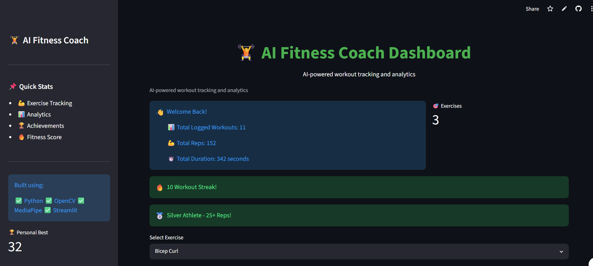
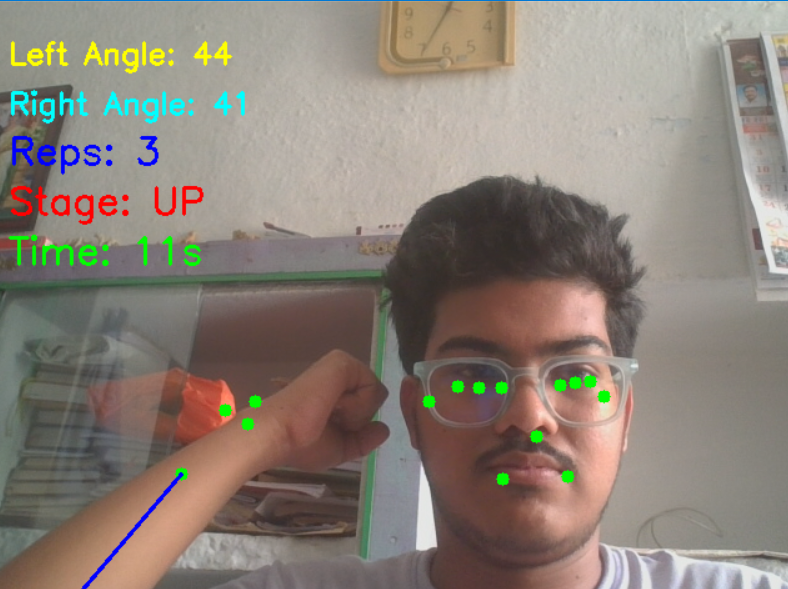
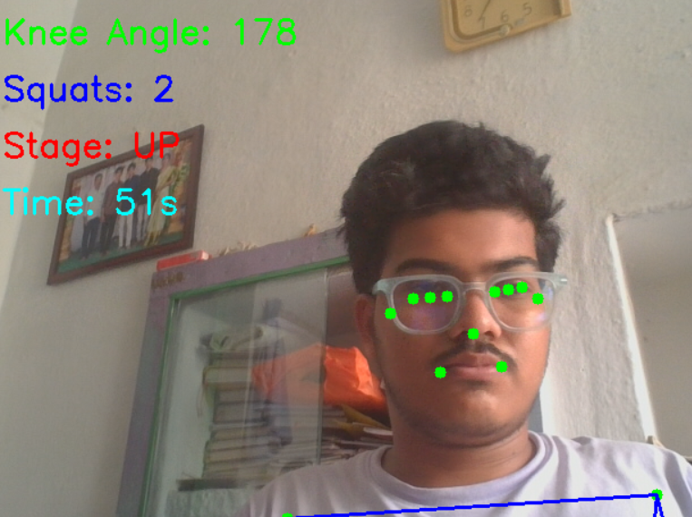
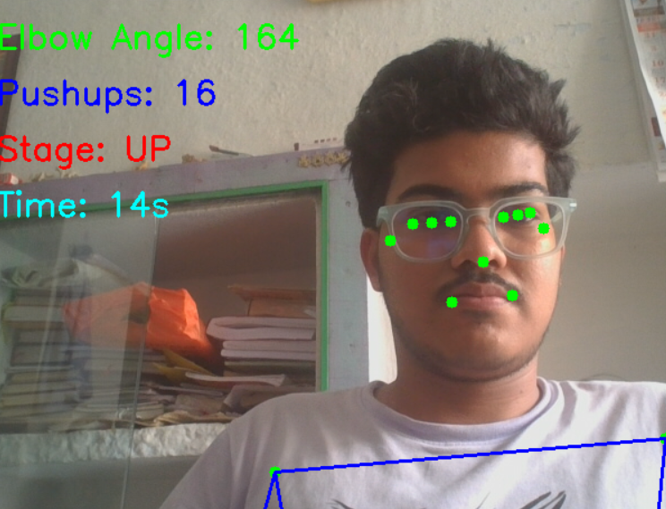
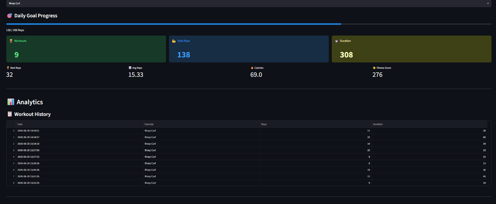

# AI Fitness Coach 🏋️‍♂️

An AI-powered fitness coaching system built using Python, OpenCV, MediaPipe, and Streamlit.

## 🌐 Live Demo

https://ai-fitness-coach-9sxapbnaaggbqngbeholmj.streamlit.app

## Features

* Real-time pose detection
* Skeleton tracking
* Bicep curl counter
* Squat counter
* Push-up counter
* Workout timer
* Workout logging
* Streamlit analytics dashboard
* Exercise distribution charts
* Achievement system

## Technologies Used

* Python
* OpenCV
* MediaPipe
* Streamlit
* Pandas
* Matplotlib

## Project Structure

* `pose_test.py` → Bicep Curl Counter
* `squat_counter.py` → Squat Counter
* `pushup_counter.py` → Push-Up Counter
* `app.py` → Dashboard
* `pose_detector.py` → Pose Detection Engine
* `utils.py` → Angle Calculations

## Run Locally

Install dependencies:

pip install -r requirements.txt

Run Dashboard:

streamlit run app.py

Run Exercise Counters:

python pose_test.py

python squat_counter.py

python pushup_counter.py

## 📸 Project Screenshots

### Dashboard

### Bicep Curl Counter

### Squat Counter

### Push-Up Counter

### Analytics Dashboard

## Future Enhancements

* Voice Coaching
* Calorie Estimation
* Weekly Reports
* Cloud Deployment

## Author

Yaswanth
B.Tech Computer Science
AI & Computer Vision Enthusiast
